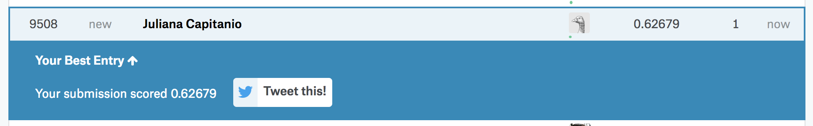
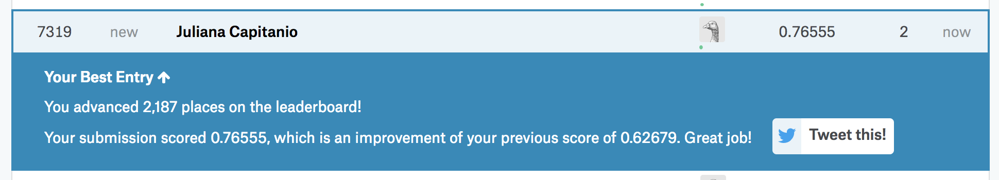
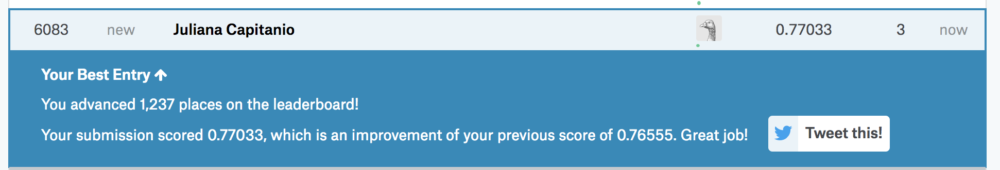

Now that we have downloaded all the datasets let's load them into R. From kaggle, here is what we have:

* The __training set__ should be __used to build your machine learning models__. For the training set, we provide the outcome (also known as the “ground truth”) for each passenger. Your model will be based on “features” like passengers’ gender and class. You can also use feature engineering to create new features.

* The __test set__ should be used to see __how well your model performs on unseen data__. For the test set, we do not provide the ground truth for each passenger. It is your job to predict these outcomes. For each passenger in the test set, use the model you trained to predict whether or not they survived the sinking of the Titanic.

* The __gender_submission.csv__, a set of predictions that assume all and only female passengers survive, as an __example of what a submission file should look like__.

Loading the datasets:
```{r}
train <- read.csv("Data/train.csv", stringsAsFactors=FALSE)
test <- read.csv("Data/test.csv", stringsAsFactors=FALSE)
examplesub <- read.csv("Data/gender_submission.csv", stringsAsFactors=FALSE)
```

Note: You can also do this by clicking the *Import Dataset* button on the top right.

Just to see how Kaggle works, let's prepare a submission where everyone died :(

By looking at their example we see that all we need to submit is a table containing the PassengerId and and our prediction of if they lived (1) or died (0).
```{r}
head(examplesub)
```

So to create our all dead submission all we need is to join the PatientId with a vector of similar size filled with zeros.

```{r}
alldead <- cbind(PassengerId = test$PassengerId,Survived = rep(0, dim(test)[1]))
head(alldead)
dir.create("submissions")
write.csv(alldead,"submissions/alldead.csv", row.names = F)
```

We can submit that prediction to Kaggle and see how we score.

Submission page: https://www.kaggle.com/c/titanic/submit

Results apear here: https://www.kaggle.com/c/titanic/leaderboard

Here is the image for my submission of this example:



Let's see if we can do better. The example submission proposed that all the man died and the woman survived. Is there any truth to the whole "women and children first" idea?

Here is what our training data looks like:

```{r}
View(train)
```

If we compare the proportion of men and women that survived we have:
```{r}
#install.packages("tidyverse")
library(tidyverse)

train %>%
  group_by(Sex, Survived) %>%
  summarise (n = n()) %>%
  mutate(freq = n / sum(n))
```

Seems like there is something to that after all. We can see if creating a submission where all the ladies survive and the gents die will improve our score.

```{r}
test %>% 
    add_column(Survived = if_else(test$Sex == "female", 1, 0)) %>% 
    select(PassengerId, Survived) %>% 
    write_csv("submissions/mandied.csv")
```

We'll go back to Kaggle and submit that to see how we do.


Definite improvement.

Now for some very simple feature engineering. We can look some more into wether or not the children had a better chance of survival. Since age is a continuous variable, we can use it to create a new categorical variable classifying the passengers as children or not. I chose an arbitrary cutoff of 13 years old and assumed missing age values were not children, since most of the passengers were over 20.

```{r}
summary(train$Age)
```


```{r}
train <- add_column(train, Child = if_else(train$Age < 13, 1, 0, missing = 0))
```

```{r}
train %>%
    group_by(Child, Survived) %>%
    summarise (n = n()) %>%
    mutate(freq = n / sum(n))
```

Maybe children had a slightly better chance of survival. We need to add that new variable to our test dataset too, so we can use it later in our predictions.

```{r}
test <- add_column(test, Child = if_else(test$Age < 13, 1, 0, missing = 0))
```

We can try another submission assuming all women and children survived:

```{r}
test %>% 
    add_column(Survived = if_else(test$Sex == "female" | test$Child == 1, 1, 0)) %>% 
    select(PassengerId, Survived) %>% 
    write_csv("submissions/womenchildrenlive.csv")
```



A little bit better again, but not much.

We could get even fancier with our feature engineering, for example, the Name column would let us identify the number of passengers with the same last name to create a variable for family size. But we'll skip that for the sake of time and you can try it at home to see if it improves your score.

Let's instead see if we can use a different model to improve our predictions. We'll go for the Random Forest, which is an ensemble model of many classification trees.

Here is a definition from stat.berkeley:

_Random Forests grows many classification trees. To classify a new object from an input vector, put the input vector down each of the trees in the forest. Each tree gives a classification, and we say the tree "votes" for that class. The forest chooses the classification having the most votes (over all the trees in the forest)._

A classification tree will take what we were already doing by hand to an entire new level. It will still partition the data based on different variables, but it will split it into smaller and smaller groups recursively (e.g. male or female, child or not, cheap or expensive fare, etc.). Here is an example from https://www.kdnuggets.com/2016/09/decision-trees-disastrous-overview.html


Now imagine many, many, many of these trees made with different subsets of our data and pruned at different heights and you have yourself a random forest.

So let's do it.
Note: since this is a random process we need to set the seed to make sure we all get the same results.

```{r}
#install.packages('randomForest')
library(randomForest)
set.seed(415)
```

Creating the model, you can do this with whichever variables you'd like. The passenger cabin, ticket number, and name, for example, are likely irrelevant as they are now, and could be removed from the model.

Note: We could have used these variables for feature engineering though, like mentioned with figuring out the size of the family using the name. We could also try to find out the ship deck or how close to the iceberg impact site a passenger's cabin was from the cabin numbers. But we'll leave that alone for now and remove these variables from the model.

We also have 2 blank values on the variable Embarked that we need to fix before fitting the model, since most of the passengers embarked at S (Southampton), we'll just inpute those values.
```{r}
summary(as.factor(train$Embarked))
train$Embarked[train$Embarked == ""] <- "S"
summary(as.factor(train$Embarked))
```

The default for the randomForest function is to fail when there are missing values, so we can first impute what is missing on the dataset. In order to do that we need to transform the character variables into factors and the integer variables into numeric:

```{r}
train.imputed <- as.data.frame(unclass(train))
train.imputed[,c(2, 3, 13)] <- lapply(train.imputed[,c(2, 3, 13)], as.factor)
train.imputed[,c(1,7,8)] <- lapply(train.imputed[,c(1,7,8)], as.numeric)

train.imputed <- select(train.imputed, PassengerId, Survived, Pclass, Sex, Age, SibSp, Parch, Fare, Embarked, Child)
set.seed(222)
train.imputed <- rfImpute(Survived ~ ., train.imputed)
```


Now we fit the model:
```{r}
RFfit <- randomForest(Survived ~ Pclass + Sex + Age + SibSp + Parch + Fare + Embarked + Child, data=train.imputed, importance=TRUE, ntree=2000)
```

As expected, sex is one of the most important predictive variables:
```{r}
varImpPlot(RFfit)
```

Here is a quick explanation for the plots above from http://trevorstephens.com/kaggle-titanic-tutorial/r-part-5-random-forests/

_There’s two types of importance measures shown above. The accuracy one tests to see how worse the model performs without each variable, so a high decrease in accuracy would be expected for very predictive variables. The Gini one digs into the mathematics behind decision trees, but essentially measures how pure the nodes are at the end of the tree. Again it tests to see the result if each variable is taken out and a high score means the variable was important._

Finally, we use the prediction function to apply this model to our test data and predict who survived. We need to first impute any NAs here so that our survival prediction does not end up with NA values.

```{r}
colSums(is.na(test))
```

We have 1 NA for fare and several for age. Let's impute the average fare and age to the NAs.

```{r}
test$Fare[is.na(test$Fare)] <- mean(test$Fare, na.rm = T)
test$Age[is.na(test$Age)] <- mean(test$Age, na.rm = T)
colSums(is.na(test))
```

We also need to make sure the type of data in our test set is the same as our train.imputed data used to create the model. 
```{r}
test.imputed <- as.data.frame(unclass(test))
test.imputed[,c(2, 12)] <- lapply(test.imputed[,c(2, 12)], as.factor)
test.imputed[,c(1, 5, 6)] <- lapply(test.imputed[,c(1, 5, 6)], as.numeric)

test.imputed <- select(test.imputed, PassengerId, Pclass, Sex, Age, SibSp, Parch, Fare, Embarked, Child)
```

Now for the prediction
```{r}
Prediction <- predict(RFfit, test.imputed)
submit <- data.frame(PassengerId = test$PassengerId, Survived = Prediction)
write.csv(submit, file = "submissions/firstforest.csv", row.names = FALSE)
```

We'll submit this to kaggle again and see if improved our scores.


A little better again.

I think we all get the idea. Of course this is a much simplified version of this process. How about we try to make it a little better and share our results?
One great resource is to look at the kernels published by others. For example, the R code shared here (https://www.kaggle.com/pratikmirani/my-first-gp-in-r) score around 0.9 using genetic programming. You can learn more about this subject here: https://topepo.github.io/caret/feature-selection-using-genetic-algorithms.html

Thanks for coming!

Juliana


References (this tutorial was inspired by the following sources):

* http://trevorstephens.com/kaggle-titanic-tutorial/getting-started-with-r/
* https://www.youtube.com/watch?v=Zx2TguRHrJE
* https://www.kaggle.com/benhamner/random-forest-benchmark-r/code